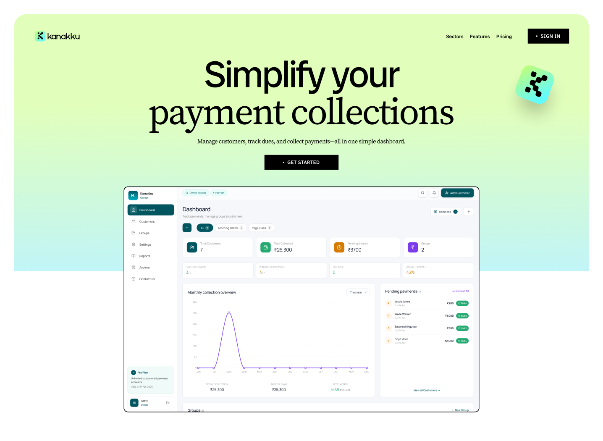

# Vignesh B — portfolio (version 3)

> **Version 3 — the active branch.** Forked from v2 as an exact copy.
>
> | Version | Folder | State |
> |---|---|---|
> | v1 | `../award-portfolio/` | Frozen. "Vignesh B", two-part role line, no logo strip. |
> | v2 | `../award-portfolio-v2/` | Frozen checkpoint. "Vignesh", three-part positioning line, logo strip. |
> | **v3** | `award-portfolio-v3/` | **Active — all new work happens here.** |
>
> Open `index.html` to view. Nothing else needed.

## Running it locally

There is no build step — it is plain HTML, CSS and JS. But **do not test by
double-clicking `index.html`.** Over `file://` the browser blocks `fetch`, so
the résumé download silently falls back, and some behaviour differs from
production. Always serve it over HTTP:

```bash
cd "award-portfolio-v3"

# any one of these
npx serve@latest . -l 5173          # then open http://localhost:5173
python3 -m http.server 5173         # same, no Node needed
npx vercel dev                      # closest to production: applies vercel.json
```

`npx vercel dev` is the one to use before deploying — it is the only local
server that applies the headers and `cleanUrls` from `vercel.json`.

## Deploying to Vercel

The project root **is this folder**. It contains no framework and needs no
build command.

```bash
cd "award-portfolio-v3"
npx vercel            # first run links the project, then publishes a preview
npx vercel --prod     # publish to the production domain
```

Or through the dashboard: push this folder as the repository root, import it,
and set **Framework Preset: Other**, **Build Command: (none)**, **Output
Directory: (leave empty)**. If you instead push the parent `Mobile app` folder,
you must set **Root Directory** to `award-portfolio-v3`, otherwise Vercel will
serve the wrong version — v1 and v2 are siblings and also contain an
`index.html`.

### What ships

`.vercelignore` keeps 5.1 MB of superseded artwork, the `.otf` font source and
macOS `.DS_Store` files out of the deploy — 3.3 MB goes up instead of 8.2 MB.
Nothing excluded is referenced by any page; if you wire one of those files back
in, remove its line from `.vercelignore` first or it will 404 in production
while working perfectly on your machine.

`vercel.json` sets cache lifetimes (a year for fonts, a month for images, an
hour for CSS/JS so edits appear promptly) and a few standard security headers.

### Before you go live

- **The two embedded Figma prototypes must be shared publicly.** In Figma:
  Share → Anyone with the link → can view. If they are restricted, visitors
  get a sign-in wall inside the phone instead of your work. Everything else on
  the page degrades gracefully; this one does not.
- **Sharp Grotesk is a commercial font** and `assets/fonts/` will be publicly
  downloadable once deployed. Check your licence covers web embedding.
- **Link previews** use relative URLs in `og:image` / `og:url`. Once the domain
  is known, make them absolute (`https://yourdomain.com/...`) — some scrapers
  refuse relative paths.
- **GSAP, ScrollTrigger and Lenis load from public CDNs.** If a CDN is blocked
  the page still works (there is an IntersectionObserver fallback), but the
  scroll story is lost. Self-hosting those three files removes that dependency.

## Hero background artwork (AI nature scene)

Off by default — the hand-built CSS sky runs as before. To put a real image or
video behind the hero, drop the file in `assets/hero/` and switch it on at the
top of `js/site.js`:

```js
const HERO_MEDIA = {
  type: 'video',                    // 'none' | 'image' | 'video'
  src:  'assets/hero/valley.mp4',
  poster: 'assets/hero/valley.jpg', // still frame
  tone: 'light'                     // 'light' | 'dark' — how the artwork reads
};
```

`tone` matters: set it to `dark` and the scrim inverts and the hero type turns
light, so the words stay readable on a moody scene without you touching CSS.

What it handles for you:

- **Readability.** A radial scrim sits behind the copy and fades to nothing at
  the edges, so the artwork still shows but the type never fights it.
- **A soft bottom edge.** A masked blur dissolves the last third of the image
  into the page rather than ending on a hard horizontal line.
- **Phones and reduced motion** get the poster still instead of the video —
  lighter on data and battery, and respectful of the motion preference.
- **A missing or unplayable file** removes the layer entirely and falls back to
  the CSS sky. No black box, no broken-image icon.
- The drawn rays and clouds dial back automatically so they don't muddy a real
  photograph.

### Producing the artwork

Midjourney, Firefly or Sora all work. Something along these lines matches the
palette already in the page:

> A serene wide valley at first light, soft mist over a winding river, distant
> blue mountains, wildflower meadow in the foreground, painterly storybook
> illustration, warm muted greens and pale gold, gentle diffused light,
> cinematic wide shot, no people, no text — 16:9

Export notes: **16:9**, at least **2400px** wide for the still. For video keep it
**8–12 seconds**, **1080p**, **H.264 MP4**, ideally **under 6 MB** — it is the
first thing that loads, so weight here is felt immediately. Slow drifting motion
loops best; anything with a strong direction makes the loop point obvious.

## Swapping in the real company logos

The strip currently uses styled wordmarks so the layout is final now. Each one is
a drop-in slot — put the files in `assets/logos/` and replace the span:

```html
<!-- before -->
<li class="split-up"><span class="logo" data-logo="zoho">Zoho</span></li>

<!-- after -->
<li class="split-up"></li>
```

Spacing, the separator dots, the greyscale-to-colour hover and the staggered
entrance all carry over untouched — `.prev-logos img` is already styled. SVG is
ideal; PNG at 2× also works. Keep `alt` text, since these are meaningful logos
rather than decoration.


A cinematic scroll portfolio. Open `index.html` in a browser — no build step, no server needed.

```
award-portfolio/
├── index.html      content + structure
├── css/site.css    palette, type, the six-chapter atmosphere
├── js/site.js      Lenis + GSAP story, cursor, splits, counters
├── assets/         project imagery
└── README.md
```

## The journey

Scrolling walks through six moods. Each section carries a `data-ch` attribute and
the `<body data-chapter>` value follows it, which is what crossfades the sky,
sun, ridgelines, water, birds, leaves, stars and fireflies.

| Chapter | Section | Mood |
|---|---|---|
| 01 Morning | Hero | Warm white, sunbeams, clouds, birds |
| 02 Forest | About | Light green, falling leaves, strong rays |
| 03 Mountains | Skills | Soft blue, ridgelines, drifting cloud |
| 04 River | Work | Blue-green, water ripples |
| 05 Sunset | Achievements + Process | Golden, sun low and large |
| 06 Night | Contact | Deep green-blue, moon, stars, fireflies |

To retune a mood, edit the matching `.sky-*` gradient and the
`body[data-chapter="…"]` rules in `css/site.css`. Nothing in JS needs touching.

## Replacing the placeholder images

Three project visuals are placeholder panels; two use real screenshots already.
Every image position is marked with `data-slot`, so swapping is a one-line edit.

| Slot | Currently | To replace |
|---|---|---|
| `kanakku-cover` | placeholder panel | drop `assets/kanakku-cover.png`, then swap the `<div class="ph ph-fin">` for an `` |
| `creator-cover` | placeholder panel | same, with `assets/creator-cover.png` |
| `rpa-cover` | placeholder panel | same, with `assets/rpa-cover.png` |
| `radius-cover` | real screenshot | replace the file in `assets/` |
| `ring-sizer` | real screenshot | replace the file in `assets/` |

The `` to paste in place of a placeholder:

```html

```

Layout and animation are attached to the `.shot-frame` wrapper, not the image, so
the parallax and zoom keep working with no further changes. Landscape crops
around 16:10 sit best.

Also worth adding: `assets/resume.pdf`, then point the `#resume` link at it and
delete the click handler at the bottom of `js/site.js`.

## Notes on the build

- **No CSS keyframes drive the story** — ambient loops (clouds, leaves, wings,
  ripples, twinkle) are CSS; everything scroll-linked is GSAP ScrollTrigger.
- **Split text is hand-rolled.** GSAP's SplitText is a paid plugin, so
  `splitLines()` measures word offsets to find real visual lines and wraps each
  in an overflow mask. It re-reads layout, so it runs before the loader lifts.
- **Graceful degradation.** If the CDNs are blocked the page still works:
  `fallbackReveals()` takes over with IntersectionObserver, and if even that is
  missing everything is shown outright. Counters and the tree are filled in
  before any observer is constructed, so they can never be stranded at zero.
- **Reduced motion** is fully honoured — pins and horizontal scroll unwind into a
  normal vertical document, and the custom cursor is removed.
- **Mobile** drops the pinned horizontal process to a vertical stack, unsticks the
  project panels, and skips tilt and magnetic effects.

## Contact form — where messages go

There is no server behind this page, so "Send message" hands off to an app the
visitor already has, with the message pre-written. Set your number at the top of
`js/site.js`:

```js
const CONTACT = {
  whatsapp: '919876543210',   // country code + number, digits only, no +
  email: 'vignesh.babu@zohocorp.com'
};
```

- **Number set** → opens WhatsApp (`wa.me`) with the name, email and message
  already typed. The visitor taps send; it lands in your normal WhatsApp. Works
  on desktop (WhatsApp Web) and mobile (the app).
- **Left empty** → falls back to the visitor's email client, and the WhatsApp
  row removes itself from the contact list rather than sitting there dead.

Spaces, dashes and a leading `+` are stripped automatically, so
`+91 98765 43210` works fine.

Worth knowing: this opens *their* WhatsApp, so they see your number — that is
how every `wa.me` link works. If you'd rather not publish it, leave `whatsapp`
empty and use a real form service (Formspree, Web3Forms, Resend) posting from
`initForm()`; then nothing personal is exposed and messages arrive even if the
visitor has no mail client set up.

## Known limitations
- Fonts come from Google Fonts (Geist + Geist Mono). Self-host them for the best
  Lighthouse score.
- The atmosphere is CSS and SVG, not WebGL — deliberately, to hold 60fps on
  laptops without a discrete GPU.
